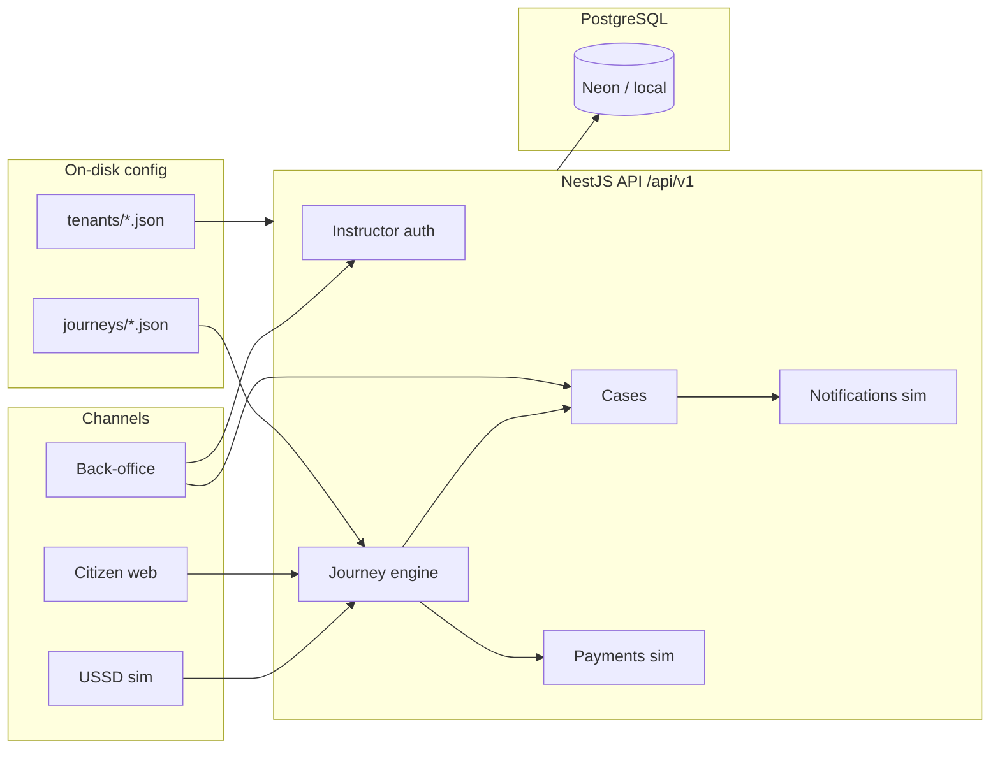

# Allô Services architecture (MVP)

## Goal

An **open-source**, **multi-tenant**, **modular**, and **highly configurable** platform that states can adopt by applying country parameters in `config/` — not by forking business logic.

The public demo proves:

1. Multi-service citizen journeys (simulated USSD)  
2. Simulated payment and SMS  
3. Back-office instruction **adapted per service type**  
4. Two tenants: **Togo (full pack)** vs **Benin (thinner pack)**

## Overview

## Modules

| Module | Status | Role |
|--------|--------|------|
| `platform-core` | Yes | Tenant isolation, Prisma sync |
| `journey-engine` | Yes | Declarative JSON journeys |
| `case-management` | Yes | Cases, transitions, tracking |
| `partner-backoffice` | Yes | Instruction + instructor JWT |
| `channels-ussd` / `channels-web` / `channels-sms` | Yes | Simulators |
| `payments` / `notifications` | Yes | `simulator` connectors |
| `service-pack-civil-status` | Yes | Birth certificate |
| `service-pack-appointments` | Yes | Appointment booking |
| `service-pack-bill-payment` | Yes | Bill payment (TG) |
| voice / WhatsApp / agents / NLU | No | Later phases |

A tenant’s USSD home menu = **journeys whose `service-pack-*` is listed in `modules`**.

## Reference tenants

| | Togo `tg` | Benin `bj` |
|---|-----------|------------|
| USSD | `*855#` | `*711#` |
| Locales | fr, ee, en | fr, en |
| Packs | civil + appointments + bills | civil + appointments |
| Birth fee | 500 XOF | 300 XOF |

## Service-specific instruction

Same status engine (`in_review` → ready / incomplete / rejected → delivered / closed), but **action labels and SMS** depend on `serviceCode`:

- `ETC_ACTE_NAISSANCE` — certificate ready / missing document  
- `RDV_SANTE` — confirm appointment / other slot  
- `PAY_FACTURE` — validate receipt / correction  

Defined in `packages/shared` (API) with a web UI mirror.

## Design principles

1. **API-first** — every UI uses `/api/v1`.  
2. **Config over code** — tenants and journeys live in `config/`.  
3. **Swappable connectors** — `simulator` today, real operators tomorrow.  
4. **Modular monolith** — no microservices at MVP stage.  
5. **Sovereignty** — real citizen data stays with the state; product sandbox is separate.

## Stack

- API: NestJS + Prisma + PostgreSQL  
- Web: Next.js  
- Containers: Docker Compose  
- License: Apache-2.0  

## Demo hosting

Neon (Postgres) + Fly.io (API) + Vercel (web) — see [deploy.en.md](deploy.en.md).

## Next

See [roadmap.en.md](roadmap.en.md).
