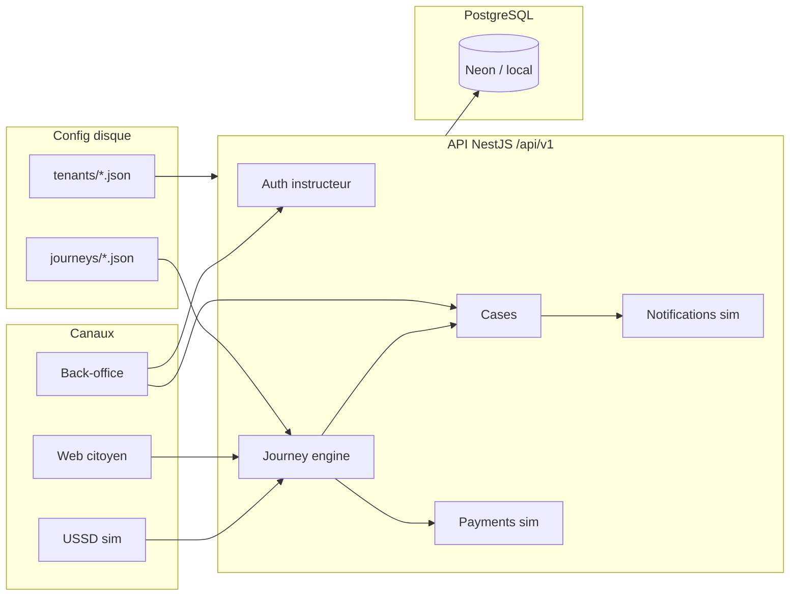

# Architecture Allô Services (MVP)

## Objectif

Socle open source **multi-tenant**, **modulaire** et **paramétrable**, destiné à être déployé auprès des États. Un pays adopte la plateforme en ajoutant de la configuration (`config/`), pas en forçant un fork métier.

La démo publique prouve :

1. Parcours citoyens multi-services (USSD simulé)  
2. Paiement et SMS simulés  
3. Instruction back-office **adaptée au type de service**  
4. Deux tenants : **Togo (pack complet)** vs **Bénin (pack réduit)**

## Vue d’ensemble

## Modules

| Module | Statut | Rôle |
|--------|--------|------|
| `platform-core` | Oui | Isolation tenant, sync Prisma |
| `journey-engine` | Oui | Parcours JSON déclaratifs |
| `case-management` | Oui | Dossiers, transitions, suivi |
| `partner-backoffice` | Oui | Instruction + JWT instructeur |
| `channels-ussd` / `channels-web` / `channels-sms` | Oui | Simulateurs |
| `payments` / `notifications` | Oui | Connecteurs `simulator` |
| `service-pack-civil-status` | Oui | Acte de naissance |
| `service-pack-appointments` | Oui | Prise de RDV |
| `service-pack-bill-payment` | Oui | Paiement facture (TG) |
| voice / WhatsApp / agents / NLU | Non | Phases suivantes |

Le menu USSD d’un tenant = **parcours dont le `service-pack-*` est dans `modules`**.

## Tenants de référence

| | Togo `tg` | Bénin `bj` |
|---|-----------|------------|
| USSD | `*855#` | `*711#` |
| Locales | fr, ee, en | fr, en |
| Packs | civil + RDV + factures | civil + RDV |
| Frais acte | 500 XOF | 300 XOF |

## Instruction par service

Même moteur de statut (`in_review` → prêt / complément / rejet → remis / clos), mais **libellés d’actions et SMS** selon `serviceCode` :

- `ETC_ACTE_NAISSANCE` — acte prêt / pièce manquante  
- `RDV_SANTE` — confirmer RDV / autre créneau  
- `PAY_FACTURE` — valider reçu / correction  

Définition : `packages/shared` (API) + miroir UI web.

## Connecteurs (extension opérateurs)

Interfaces dans `apps/api/src/connectors/` :

| Id | Canal | Rôle |
|----|--------|------|
| `simulator` | paiement + SMS | Démo locale / TG par défaut |
| `stub-momo` | paiement | Faux agrégateur Mobile Money |
| `stub-sms` | SMS | Fausse passerelle SMS |

Sélection : `config/tenants/*.json` → `connectors.payment` / `connectors.sms` (prioritaire), sinon variables d’environnement `PAYMENT_CONNECTOR` / `SMS_CONNECTOR`, sinon `simulator`.

Catalogue runtime : `GET /api/v1/connectors` · par tenant : `GET /api/v1/connectors/:tenantId`.

Pour brancher un vrai opérateur : implémenter `PaymentConnector` ou `SmsConnector`, l’enregistrer dans `ConnectorsModule`, référencer l’id dans le tenant.

**Référence démo** — TG = `simulator` / `simulator` · BJ = `stub-momo` / `stub-sms`.

## Principes

1. **API-first** — toute UI passe par `/api/v1`.  
2. **Config over code** — tenants et parcours dans `config/`.  
3. **Connecteurs substituables** — même interface, simulateur / stub / SDK réel.  
4. **Monolithe modulaire** — pas de microservices au stade MVP.  
5. **Souveraineté** — données citoyens réelles chez l’État ; sandbox produit séparé.

## Stack

- API : NestJS + Prisma + PostgreSQL  
- Web : Next.js  
- Conteneurs : Docker Compose  
- Licence : Apache-2.0  

## Hébergement démo

Neon (Postgres) + Fly.io (API) + Vercel (web) — voir [deploy.fr.md](deploy.fr.md).

## Suite

Voir [roadmap.fr.md](roadmap.fr.md).
